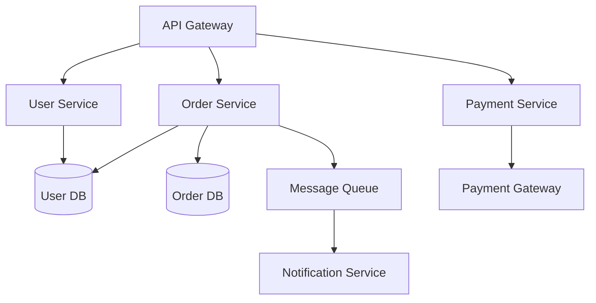

# Example: Architecture Diagram (Graph Pipeline)

## Input

````markdown
/svg-create

样式：商务蓝，16:9，中文
````

## Expected Output

A layered architecture diagram showing:
- Layer 0 (Entry): API Gateway (hexagon)
- Layer 1 (Business Services): User Service, Order Service, Payment Service (rounded_rect)
- Layer 2 (Data): User DB, Order DB (cylinders)
- Layer 2 (Infrastructure): Message Queue (rounded_rect)
- Layer 3 (External): Payment Gateway, Notification Service (rounded_rect)

Layout: Top-to-Bottom layered grid
Theme: Business blue
Dimensions: 1280×720
