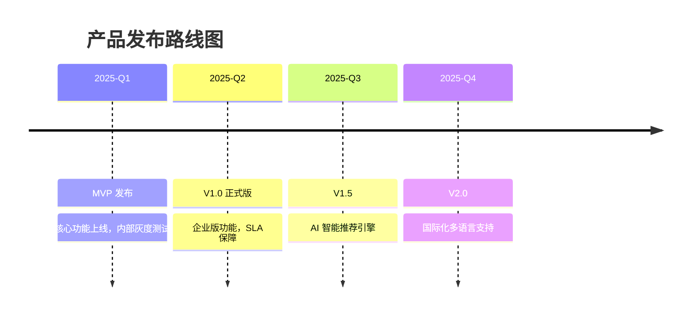

# Example: Milestone Timeline (Timeline Pipeline)

## Input

````markdown
/svg-create

样式：商务蓝，水平布局
````

## Expected Output

A horizontal milestone timeline:
- Title: "产品发布路线图" centered at top
- Horizontal time axis across the slide
- 4 milestone markers (circles) at equal intervals
- Q1: completed (green marker)
- Q2: current (blue, larger marker with "当前" label)
- Q3-Q4: upcoming (light gray markers)
- Date labels below axis
- Event titles above axis
- Descriptions in secondary color
