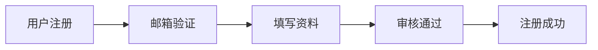
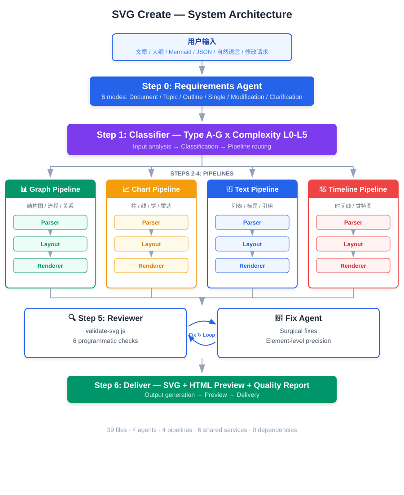
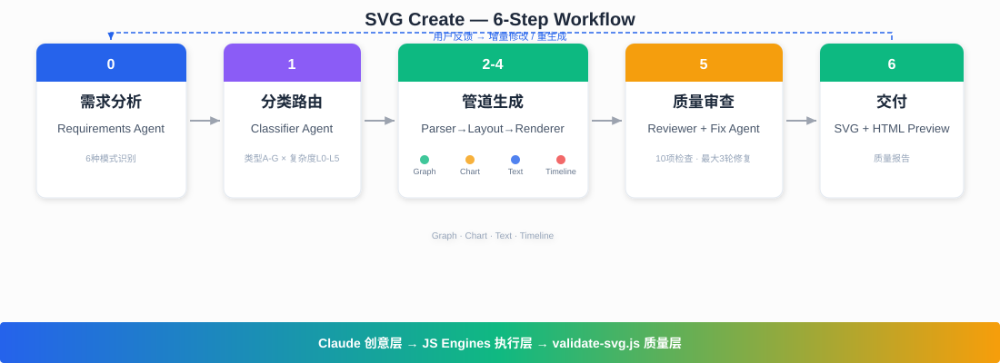
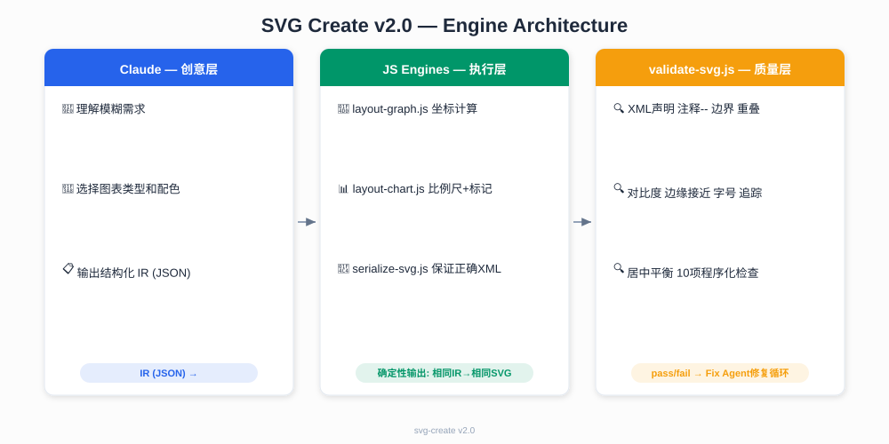
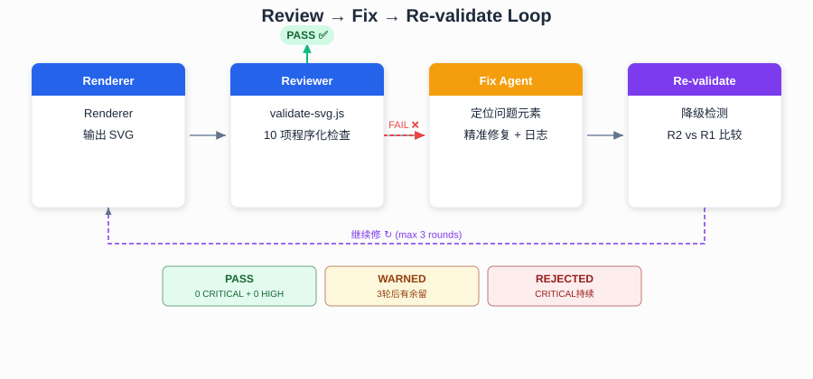

# SVG Create — Programmatic SVG Diagram Engine

> 一个 Claude Code Skill，将 Mermaid 语法、结构化数据或自然语言转换为经过 10 项程序化审查的高质量 SVG 图表。
> **主攻：** 学术论文图 · 系统架构图 · 数据图表 · 时间线 · 文档配图
> **兼修：** 多页 SVG 幻灯片 · 文本型幻灯片 · 批量生成

[](https://claude.ai/code)
[](/.claude/skills/svg-create/)
[](/.claude/skills/svg-create/agents/)
[](/.claude/skills/svg-create/pipelines/)

> 🎨 **本文档中所有架构图、流程图、示意图均由本 Skill 自身生成。** — 用 SVG Create 记录 SVG Create。

---

## 目录

- [这个 Skill 能做什么](#这个-skill-能做什么)
- [快速开始](#快速开始)
- [支持的图表类型](#支持的图表类型)
- [系统架构](#系统架构)
- [完整工作流](#完整工作流)
- [使用指南](#使用指南)
- [引擎架构 (v2.0)](#引擎架构-v20)
- [质量保障系统](#质量保障系统)
- [文件结构](#文件结构)
- [安装](#安装)
- [FAQ](#faq)
- [设计原则](#设计原则)

---

## 这个 Skill 能做什么

**一句话**：输入 Mermaid/JSON/自然语言 → 输出经过 10 项程序化审查的高质量 SVG 图表。

| 输入 | 输出 |
|------|------|
| Mermaid `graph TD` 代码块 | 专业排版的架构图 / 流程图 / ER 图 |
| 一组 JSON 数据 | 柱状图 / 折线图 / 饼图 |
| 自然语言 "画一个微服务架构图" | 精美的架构图 SVG |
| 精确坐标 + 颜色规格 | 学术论文级别的复杂图表 |
| 自然语言 + 样式描述 | 文档配图 / README 插图 |

**核心能力**：5 种输入模式 × 7 种图表类型 × 5 个 JS 引擎 × 10 项程序化审查。

---

## 快速开始

### 示例 1：一句话生成架构图

```
/svg-create 画一个微服务架构图，包含API网关、用户服务、订单服务和PostgreSQL数据库。商务蓝配色。
```

### 示例 2：Mermaid 生成流程图

````
/svg-create

````

### 示例 3：JSON 数据生成图表

````
/svg-create chart
```json
{
  "type": "bar",
  "title": "Q3 各部门营收",
  "categories": ["研发", "销售", "市场", "运营"],
  "series": [
    {"name": "Q2", "data": [120, 200, 150, 80]},
    {"name": "Q3", "data": [140, 230, 160, 95]}
  ]
}
```
````

### 示例 4：精确规格生成学术图

````
/svg-create 生成一张学术时间线图，viewBox 0 0 20 8：
- 三个时期色带（蓝/绿/红），半透明
- 水平时间轴，16个里程碑节点，上下交替排列
- 每个节点包含：模型名、发表来源、日期、贡献描述
- 白色背景，sans-serif字体，学术海报风格
````

### 示例 5：文档配图（本 README 所有图均由本 Skill 生成）

```
/svg-create 生成一张横向流程图，展示 6 步工作流：
步骤0(蓝): 需求分析 → 步骤1(紫): 分类路由 → 步骤2-4(绿): 管道生成
→ 步骤5(琥珀): 质量审查 → 步骤6(绿): 交付
顶部反馈回路箭头，底部渐变条，白色背景
```

---

## 支持的图表类型

系统可以生成 **7 大类** SVG 图表：

| 类型 | 代号 | 示例 | 管道 |
|------|:--:|------|:--:|
| **结构图** | A | 架构图、流程图、ER 图、思维导图、网络拓扑 | Graph |
| **数据图表** | B | 柱状图、折线图、饼图、散点图、雷达图、漏斗图 | Chart |
| **文本渲染** | C | 要点列表、标题页、引用卡片、概念说明、双栏对比 | Text |
| **时间线** | D | 里程碑图、甘特图、项目路线图 | Timeline |
| **矩阵对比** | E | SWOT 分析、竞品对比表、2×2 矩阵 | Matrix |
| **流程步骤** | F | 步骤指南、管道图、阶段图 | Graph |
| **关系概念** | G | 韦恩图、生态地图、概念关系图 | Graph |
| **混合型** | H | 上述类型的组合（如左图表+右流程图） | 多管道并行 |

---

## 系统架构

<p align="center">
  
</p>

### Agent 角色分工

| Agent | 职责 | 输入 → 输出 |
|-------|------|-------------|
| **Requirements Agent** | 理解用户意图，规划图表结构 | 用户原始输入 → 图表计划 (每页的 generationPrompt) |
| **Classifier Agent** | 判定图表类型、复杂度、路由 | generationPrompt → {type, complexity, pipeline} |
| **Parser Agent** (×4) | 解析输入为结构化中间表示 | Mermaid/JSON/NL → 类型化 IR |
| **Layout Agent** (×4) | 计算元素坐标和边路由 | IR → Positioned IR (x, y, w, h) |
| **Renderer Agent** (×4) | 生成最终 SVG 代码 | Positioned IR + 主题 → SVG |
| **Reviewer Agent** | 程序化质量验证 | SVG 文件 → 违规报告 |
| **Fix Agent** | 根据审查报告精准修复 | SVG + 违规报告 → 修复后 SVG |
| **Compositor Agent** | 混合型图表的组合 | 多个 SVG → 合并为一张 |

### 4 条生成管道（已升级为 JS 引擎）

每条管道内部是 **Claude 创意层 + JS 执行层**：

```
Claude (创意层):      理解需求 → 输出结构化 IR (JSON)
                      │
JS Engines (执行层):  ├─ layout-graph.js   → 确定性坐标计算
                      ├─ layout-chart.js   → 轴比例尺 + 标记定位
                      └─ serialize-svg.js  → 保证正确的 SVG XML
                           (自动注入 data-svgc-* 追踪属性)
```

| 管道 | 布局引擎 | 算法 |
|------|---------|------|
| **Graph** | `layout-graph.js` | Layered Grid / Sugiyama / Tree |
| **Chart** | `layout-chart.js` | 笛卡尔坐标系 + nice ticks + 饼图角度 |
| **Text** | Claude | 文字流 + 分栏 (由 serialize-svg.js 序列化) |
| **Timeline** | `layout-graph.js` | 时间轴映射 (使用 tree 变体) |

### 共享服务层

6 个所有管道共用的服务：

| 服务 | 文件 | 作用 |
|------|------|------|
| Theme Manager | `shared/theme-manager.md` | 3套预设配色 + 自定义覆盖 |
| SVG Shell | `shared/svg-shell.md` | viewBox + defs + 背景模板 |
| Shape Library | `shared/shape-library.md` | 10种节点形状的 SVG path |
| Typography | `shared/typography.md` | 文字测量、换行、CJK 处理 |
| Preview Builder | `shared/preview-builder.md` | HTML 预览页生成 |
| Element Tracking | `shared/element-tracking.md` | 元素追踪属性规范 |

---

## 完整工作流

<p align="center">
  
</p>

---

## 使用指南

### 输入方式详解

#### 1. 文档/文章输入（自动拆解为幻灯片）

```
/svg-create
[粘贴一篇技术文章或报告]
目标受众：技术团队，5-8页，商务风格
```

需求 Agent 会自动：
- 识别文章主题和关键章节
- 确定幻灯片数量
- 为每页分配最合适的视觉类型
- 生成详细的 generationPrompt

#### 2. Mermaid 语法（精确控制）

支持的 Mermaid 类型：`graph`/`flowchart`、`sequenceDiagram`、`classDiagram`、`stateDiagram`、`erDiagram`、`gantt`、`timeline`、`pie`、`xychart`、`mindmap`、`C4`

#### 3. 结构化数据（图表专用）

```json
{
  "type": "bar|line|pie|donut|scatter|radar|funnel|area",
  "title": "...",
  "categories": [...],
  "series": [{"name": "...", "data": [...]}],
  "config": {"orientation": "vertical|horizontal", "stacked": false}
}
```

#### 4. Markdown 文本（文本幻灯片）

```markdown
---
type: bullet-list|title-slide|quote|concept-card|numbered-list|two-column
title: Slide Title
color: business-blue|dark-tech|warm-vibrant
---
## Point 1
Description
```

#### 5. 自然语言

最灵活的输入方式。可包含样式提示（"深色主题"、"横向布局"、"16:9"）。

#### 6. 修改请求

```
"把第二页的柱状图改成折线图"
"把 User Service 的颜色改成橙色"
"在架构图里加一个 Redis 节点"
```

系统自动路由到 Fix Agent，做增量修改而非重新生成。

### 配色方案

| 方案 | 主色 | 适用场景 |
|------|------|---------|
| `business-blue` (默认) | `#2563EB` | 企业汇报、技术方案、正式场合 |
| `dark-tech` | `#38BDF8` | 技术分享、开发者大会、深色主题 |
| `warm-vibrant` | `#F59E0B` | 营销提案、创意展示、工作坊 |

使用方式：在输入末尾加 `配色：深色科技风` 或 `--theme dark-tech`。

### 复杂度分级

系统根据元素数量自动决定处理深度：

| 级别 | 元素数 | 流程 |
|:----:|--------|------|
| L0 | ≤3 | 单 Agent 直接生成 |
| L1 | ≤10 | Classifier → Parser+Renderer |
| L2 | 11–30 | 完整管道 (Parser→Layout→Renderer) |
| L3 | >30 | 完整管道 + Reviewer 审查循环 |
| L4 | 混合型 | 拆分 → 多管道并行 → Compositor 组合 |
| L5 | 批量 | L0-L4 循环 + 跨页风格一致性检查 |

---

## 引擎架构 (v2.0)

**核心设计原则：Claude 做创意决策，JS 引擎做确定性计算。**

<p align="center">
  
</p>

---

## 质量保障系统

这是本 Skill 最核心的差异化能力。

### 验证器 `validate-svg.js`

一个 **1,414 行**的独立脚本，零外部依赖，对生成的 SVG 执行 **10 项**程序化检查：

| # | 检查项 | 严重级别 | 方法 |
|---|--------|:--:|------|
| 0a | XML 声明 | HIGH | 检测 `<?xml?>` — 阻止 `` 标签加载 |
| 0b | 注释 `--` | CRITICAL | 检测 XML 注释中的双连字符 — 阻止解析器 |
| 1 | 边界违规 | CRITICAL | 计算每个元素的 BBox → 检测是否超出 viewBox |
| 2 | 元素重叠 | HIGH | O(n²) 逐对比较 BBox → 查重叠允许矩阵 |
| 3 | 无追踪属性 | MEDIUM | 检测缺少 `data-svgc-*` 的元素 → 降级为启发式分类 |
| 4 | 颜色对比度 | HIGH/MED | 解析 fill 颜色 → WCAG 2.1 对比度 → 阈值 ≥4.5:1 |
| 5 | 边缘接近 | HIGH/MED | 检测元素距 viewBox 边缘 <3% 或 20px |
| 6 | 字体/比例 | MEDIUM | 标记 <8px 的不可读文字 |
| 7 | 居中平衡 | MEDIUM | 内容重心 vs viewBox 中心 → 偏移 >8% 报警 |
| 8 | 美学规则 | MEDIUM | 线-文接近 / 短桩箭头 (<15px) / 短连接器 (<20px) |
| 9 | 文本容器溢出 | HIGH | 文字是否超出其父容器 (卡片/节点) 的边界 |

### 通过标准

| 结果 | 条件 |
|:----:|------|
| ✅ **PASS** | 0 CRITICAL + 0 HIGH |
| ⚠️ **ACCEPTABLE** | 0 CRITICAL + 0 HIGH, ≤5 MEDIUM (自动修复后) |
| ⚠️ **WARNED** | 3 轮后仍有问题，但无 CRITICAL (人工审查建议) |
| ❌ **REJECTED** | CRITICAL 持续存在 (需人工介入) |

### 强制门禁 + 级联防护

**任何 SVG 变更**（生成/修复/手动编辑坐标）都**必须**经过 `validate-svg.js`：

```
变更 → validate-svg.js → pass → 交付
                        → fail → Fix Agent → 重验 (max 3轮)
                                  ├─ 改善 → 继续
                                  ├─ 停滞 → 交付+警告
                                  └─ 恶化 → 回滚上一版本
```

修复一个问题时可能引入新问题。**修改任何元素坐标后，重跑全部 10 项检查**——CHECK 9（文本容器溢出）和 CHECK 2（重叠）对位置变更最敏感。

### 修复循环

<p align="center">
  
</p>

---

## 文件结构

```
.claude/skills/svg-create/
├── SKILL.md                          ← 主入口 (触发 + 6步工作流)
│
├── agents/                           ← Agent 定义
│   ├── requirements-agent.md         ← Step 0: 需求分析 (6种模式)
│   ├── classifier.md                 ← Step 1: 类型判定 + 路由
│   ├── fix-agent.md                  ← Step 5: 精准修复闭环
│   └── compositor.md                 ← 混合型图表组合
│
├── pipelines/                        ← 4条生成管道
│   ├── graph/   (parser/layout/renderer/pipeline.md)
│   ├── chart/   (parser/layout/renderer/pipeline.md)
│   ├── text/    (parser/layout/renderer/pipeline.md)
│   └── timeline/(parser/layout/renderer/pipeline.md)
│
├── shared/                           ← 6个共享服务
│   ├── theme-manager.md              ← 配色 + 排版 + 间距
│   ├── svg-shell.md                  ← viewBox + defs 模板
│   ├── shape-library.md              ← 10种节点形状定义
│   ├── typography.md                 ← CJK/Latin 文字引擎
│   ├── preview-builder.md            ← HTML 预览生成
│   ├── element-tracking.md           ← 元素追踪属性规范
│   └── reviewer.md                   ← 验证 + 修复循环控制
│
├── scripts/                          ← JS 引擎 + 工具
│   ├── layout-graph.js               ← 图布局引擎 (Layered Grid/Sugiyama/Tree)
│   ├── layout-chart.js               ← 图表布局引擎 (坐标轴/比例尺/饼图)
│   ├── serialize-svg.js              ← SVG 序列化器 (保证 XML 正确 + 追踪属性)
│   ├── validate-svg.js               ← 1,414行程序化验证器 (10项检查 + 强制门禁)
│   └── parse-mermaid.js              ← Mermaid AST 精确解析
│
├── templates/                        ← SVG 模板
│   └── ppt-16x9.svg                  ← 默认 1280×720 模板
│
├── styles/                           ← CSS 配色变量
│   ├── palette-blue.css
│   ├── palette-dark.css
│   └── palette-warm.css
│
└── examples/                         ← 使用示例
    ├── architecture.md
    ├── bar-chart.md
    ├── bullet-list.md
    ├── timeline.md
    └── hybrid-slide.md
assets/                               ← README 配图 (均由本 Skill 生成)
├── readme-architecture.svg
├── readme-engine-architecture.svg
├── readme-workflow.svg
└── readme-fix-loop.svg
```

---

## 安装

### 方式一：克隆到项目 (推荐)

```bash
git clone https://github.com/<your-username>/svg-create.git
cp -r svg-create/.claude/skills/svg-create /path/to/your-project/.claude/skills/
```

重启 Claude Code 后直接使用 `/svg-create`。

### 方式二：手动下载

下载仓库 ZIP → 解压 → 将 `.claude/skills/svg-create/` 复制到你的项目对应目录。

### 可选依赖

核心 Skill **零依赖**即可运行。以下为可选增强：

```bash
npm install mermaid   # Mermaid 语法精确解析 (带行号级错误提示)
```

---

## FAQ

### Q: 和直接让 Claude 画 SVG 有什么区别？

A: Claude 直接画 SVG 没有结构化流程。本 Skill 提供：
- **需求分析** → 自动识别图表类型和结构
- **多管道** → 图表/文本/时间线各有专用生成流程
- **程序化验证** → 坐标级重叠检测 + WCAG 对比度检查
- **修复闭环** → 验证不通过自动修复，而非人工检查

### Q: 最多能生成多少页？

A: 单次请求建议 ≤15 页。超过此数量建议分批处理。

### Q: 能导出 PNG/PDF 吗？

A: SVG 可在浏览器中打开后另存为 PNG/PDF。后续版本计划支持直接导出。

### Q: 如何自定义品牌配色？

A: 复制 `styles/palette-blue.css`，修改 CSS 变量后保存为新文件，使用时指定 `--theme my-brand`。

### Q: 验证器报错了但图看起来没问题？

A: 检查错误的 severity。MEDIUM/LOW 级别是警告，不阻断交付。CRITICAL/HIGH 级别需要关注——它们通常意味着投影仪或打印时会出现问题。

### Q: 如何贡献新的管道或形状？

A: 
- **新管道**: 在 `pipelines/` 下创建目录，按 parser/layout/renderer/pipeline.md 模式添加 4 个文件
- **新形状**: 在 `shared/shape-library.md` 中添加 SVG path 定义
- **新配色**: 在 `styles/` 下添加 CSS 文件

---

## 设计原则

> **"让用户用最熟悉的语法表达结构，用最自然的语言描述风格。让代码验证取代肉眼审查。"**

1. **输入降级**：Mermaid → 自然语言 → 大纲，每种输入都可用
2. **渐进式复杂度**：3 个节点和 30 个节点的图走不同流程
3. **程序化验证**：不依赖 AI "看"，而是代码遍历每个元素的坐标
4. **精准修复**：像素级修改，而非每次重新生成
5. **零依赖可用**：核心能力不需要安装任何包

---

<p align="center">
  <sub>Built with ❤️ using Claude Code Skill System | 42 files | 4 agents | 4 pipelines | 6 shared services | 5 JS engines</sub>
</p>
